<h1 align="center">Hey  I'm Sanjith</h1>
<h3 align="center">Fresher - AI and ML engineer</h3>

  

## 📌 About Me
- I am a leaner who builds production-ready AI systems with a focus on LLMs, retrieval-augmented generation (RAG), and intelligent applications. I have hands-on experience developing end-to-end pipelines, from data processing to deployment, with an emphasis on real-world impact.

## 🧠 My Focus Areas
- Data Analyst
- Data Scientist
- AI and ML engineer

## 📊 GitHub Stats & Trophies

  

## 🛠️ Languages & Tools

> ## Programming Languages

> ## Frontend

 

> ## Backend

> ## Database

> ## DevOps & Cloud

> ## Tools

 

## 🔗 Connect with Me

  

## 💬 Quote
> I am just an amateur who builds, and From experimentation to production—I build AI systems that actually ship, scale, and deliver real impact

  

  

